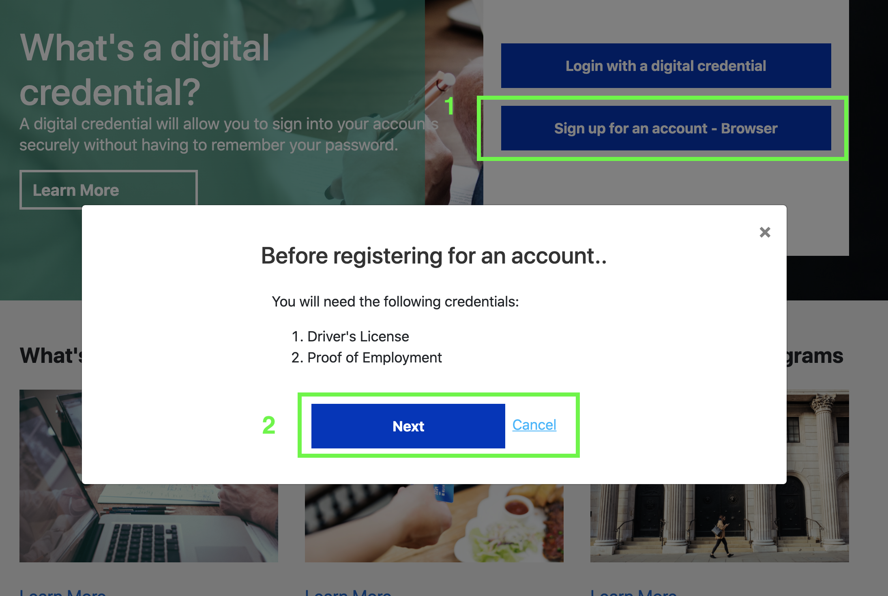
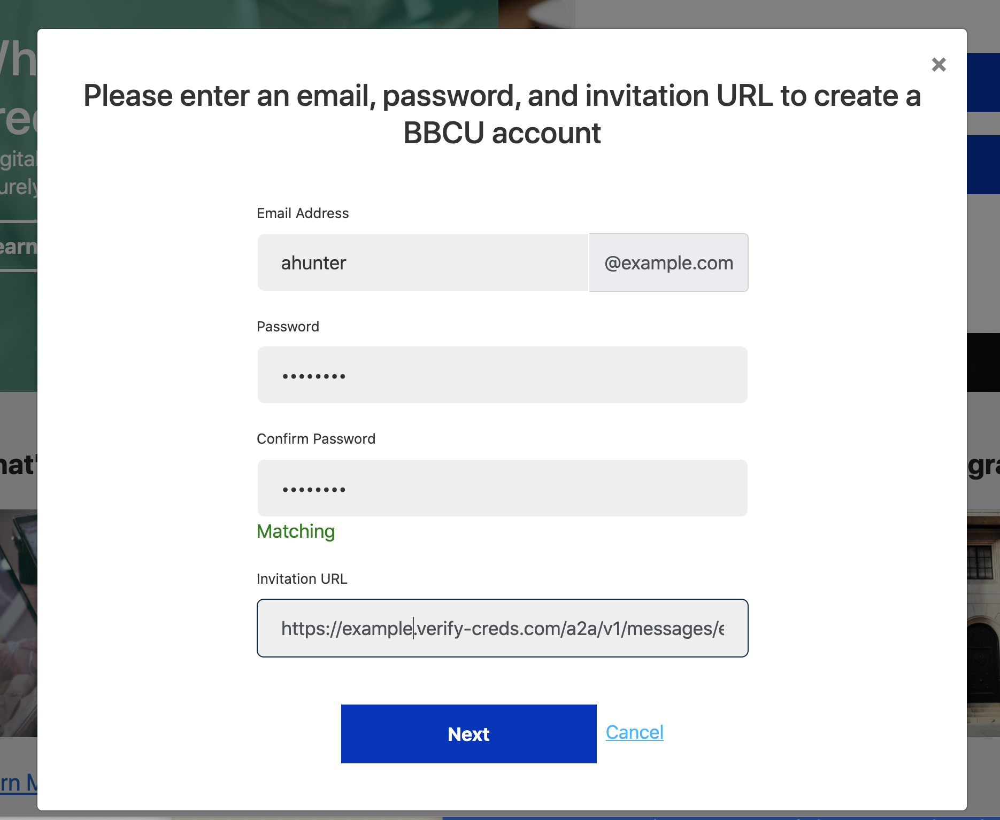
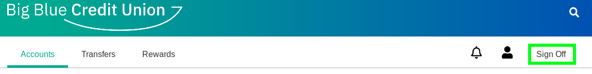
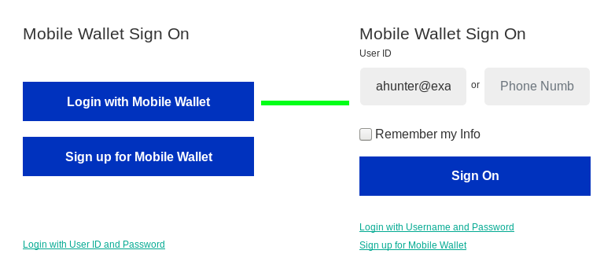
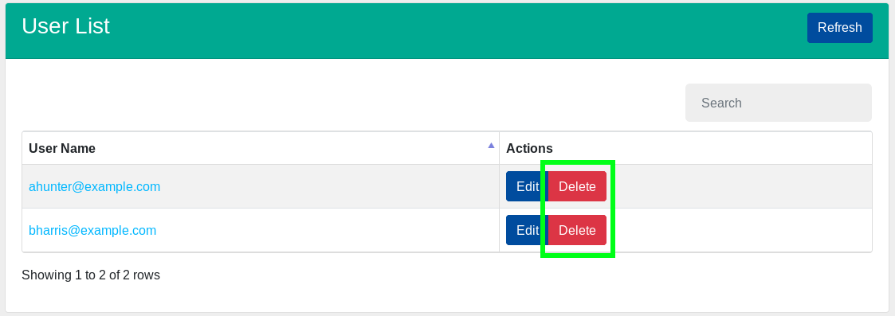
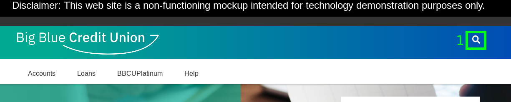
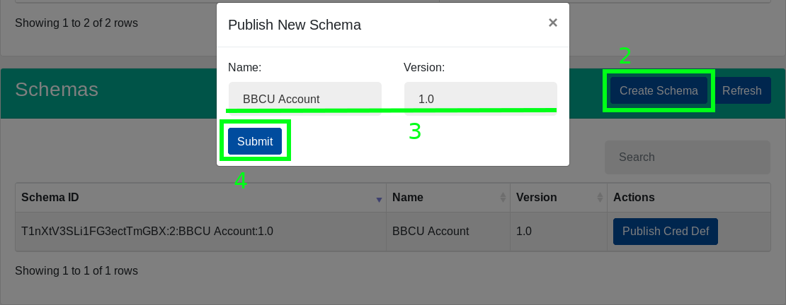
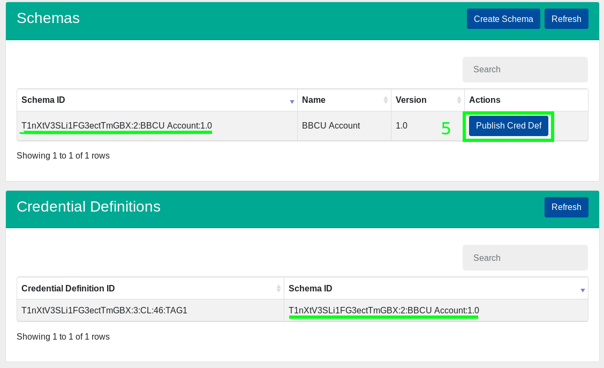

# BBCU Online

This project contains the code necessary to run a mock-up of the **BBCU Online** web app.  The mock-up is a Node.js [express](https://expressjs.com/) web app that serves APIs and web pages related to signing up for a bank account, and logging in.  The BBCU Online web app issues a bank account credential, and then checks for this credential when a user logs in.

## Part 3: Signing up for a bank account

[Click here](../README.md#passwordless-authentication-demo) to start the demo over.

[Visit this page](https://bbcu.livedemo.verify-creds.com) to play with a running instance of this sample.

### Signing up for an account

1. Click on `Sign up for an account` button on the login page.
2. Click the `Next` button on the modal that appears.
  
3. Fill out the signup form and click the `Next` button. The Agent URL entered here will be used to connect to the
your agent.
  
4. Accept the connection offer from `Big Blue Credit Union` on your mobile app.
5. Respond to proof request on your mobile app.
6. Accept the credential offer from `Big Blue Credit Union` on your mobile app.  You will be logged in to your new
account.

## Part 4: Signing in using verifiable credentials

1. Log out of your BBCU account page.
  
2. Click the `Login with a digital credential` button.
3. Enter the user name for your account and click the `Sign On` button.
  
4. Respond to the proof request on your mobile app.

## Running through the demo again

Remember to delete the user that you created before attempting [Part 3](#part-3-signing-up-for-a-bank-account) again.
This can be done from the admin panel; simply click the `Delete` button on the user's row in the User List table.
  

## Development

#### Publish a schema and a credential definition

> This only needs to be performed once. After the schema and credential definition are published, you can restart the
app without losing them.

1. Click on the small, white magnifying glass in the top right of the page.  This will open up the admin dashboard for the
BBCU app.
  
2. From the admin page, click the `Create Schema` to open the schema creation modal.
3. (Optional) fill out the name and version of the schema.  The default values should be fine unless you're experimenting.
4. Click the `Submit` button.  The new schema should appear in the schema list momentarily.
  
5. Click the `Publish Cred Def` button on the entry in the Schemas table. The new credential definition should appear in
the Credential Definitions table momentarily.
  