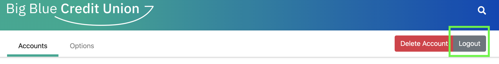
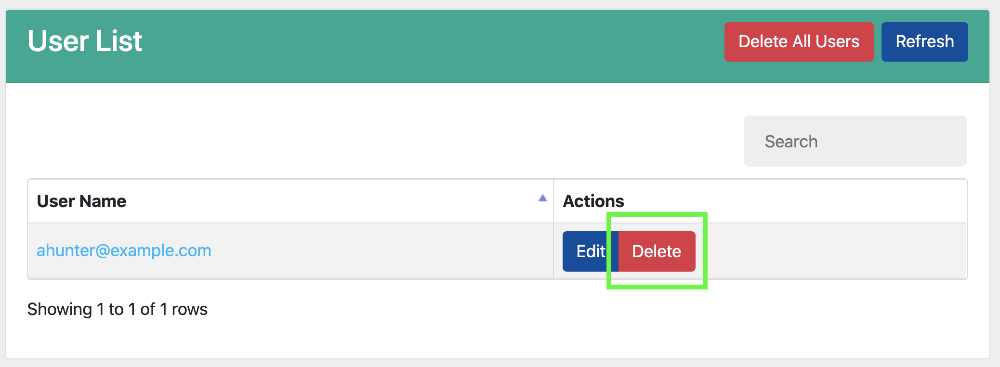

# BBCU Online

This project contains the code necessary to run a mock-up of the **BBCU Online** web app.  The mock-up is a Node.js [express](https://expressjs.com/) web app that serves APIs and web pages related to signing up for a bank account, and logging in.  The BBCU Online web app issues a bank account credential, and then checks for this credential when a user logs in.

## Part 3: Signing up for a bank account

[Click here](../README.md#passwordless-authentication-demo) to start the demo over.

[Visit this page](https://bbcu.livedemo.verify-creds.com) to play with a running instance of this sample.

There are two paths that you may take which illustrate, we belive, the two most likely user
experiences that you will have, as a digital identity user, when signing up for an account.

### Path 1: Signing up for an account manually

If you select the `I want to use browser extension` button, you will be taken through a user
experience where you will need to manually enter a username, password and Invitation URL in order
to establish an account.  This path may be taken whether you use the IBM Verify Creds browser
extension or the IBM Verify Creds mobile app.

1. Click on `Sign up for an account - Browser` button on the login page.  Again, this will
still support the mobile app.
2. Click the `Next` button on the modal that appears.
  
3. Fill out the signup form and click the `Next` button. The Invitation URL entered here will be used to connect to the agent.
  
4. Accept the connection offer from `Big Blue Credit Union` on your mobile app or browser extension.
5. Respond to proof request on your mobile app or browser extension.
6. Accept the credential offer from `Big Blue Credit Union` on your mobile app or browser extension.  You will be logged in to your new account.

### Path 2: Signing up for an account with IBM Verify Creds mobile app
If you select the `I want to use mobile app` button, you will be taken through a user experience where you don't need to provide your agent url to the BBCU application.

1. Click on the `Sign up for an account - Mobile` button on the login page.
2. Click the `Next` button on the modal that appears.
  
3. Scan the QR code in order to connect with BBCU.
4. Respond to proof request on your mobile app.
5. Accept the credential offer from `Big Blue Credit Union` on your mobile app.  You will be logged in to your new account.

## Part 4: Signing in using verifiable credentials

There are two paths that you may take which illustrate, we belive, the two most likely user
experiences that you will have, as a digital identity user, when logging into an account.

### Path 1: Logging into an account manually

1. Log out of your BBCU account page.
  
2. Click the `I want to use browser extension` button.
2. Click the `Login with a digital credential` button.
3. Enter the user name for your account and click the `Sign On` button.
  
4. Respond to the proof request on your mobile app.

### Path 2: Logging into an account with IBM Verify Creds mobile app

1. Log out of your BBCU account page.
  
2. Click the `I want to use mobile app` button.
3. Click the `Login with a digital credential` button.
4. Scan the QR code in order to connect with BBCU.
5. Respond to the proof request on your mobile app.

## Running through the demo again

Remember to delete the account that you created before attempting [Part 3](#part-3-signing-up-for-a-bank-account) again.
If you are running the samples locally, this can be done from the admin panel; simply click the `Delete` button on the
user's row in the User List table.
  
This can also be done by logging into your BBCU account and then clicking on the `Delete Account` button at the top of the page.
  

## Development

#### Publish a schema and a credential definition

> This only needs to be performed once. After the schema and credential definition are published, you can restart the
app without losing them.

1. Click on the small, white magnifying glass in the top right of the page.  This will open up the admin dashboard for the
BBCU app.
  
2. From the admin page, click the `Create Schema` to open the schema creation modal.
3. (Optional) fill out the name and version of the schema.  The default values should be fine unless you're experimenting.
4. Click the `Submit` button.  The new schema should appear in the schema list momentarily.
  
5. Click the `Publish Cred Def` button on the entry in the Schemas table. The new credential definition should appear in
the Credential Definitions table momentarily.
  

#### Integrating advanced QR Codes into your code

This sample takes advantage of QR codes to introduce a different user experience.  The IBM Verify Credentials mobile app
understands a variety of QR codes, documented [here](https://doc.ibmsecurity.verify-creds.com/develop/mobile/).  By using
these, a web app developer can communicate an agent's contact information (invitation URL) and allow the mobile app to
initiate the connections to the web app's agent.  This saves the user from having to understand invitation URLs and also
eliminates a connection offer prompt to the user, making their experience even simpler.  Web apps choosing to use these
QR codes will need to watch for incoming credential requests and verification requests that the mobile app's agent will
be sending the web app's agent when it processes the QR code.

Also worth noting, any meta information included in the QR code will make it back to the web app in any connection, credential
and verification requests spawned from scanning the QR code, as properties on those objects.  So, for example, if you add a
nonce representing a specific user that you are presenting a credential-type QR code to, when that user's agent sends the
credential request to your web app's agent, the credential object will include that nonce.  If there was no existing
connection with the user prior to scanning the QR code, the connection offer and connection that gets created when the user
scans the QR code would also contain that nonce.
