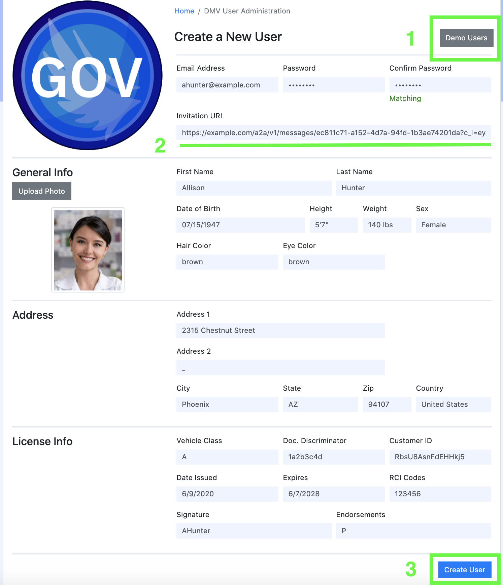

# Gov DMV

Gov DMV is an imaginary DMV that issues driver's licenses both physically and digitally.  It is implemented as a Node.js
[express](https://expressjs.com/) web app that serves up APIs and web pages related to signing up for a digital driver's
license.

## Part 1. Issuing a driver's license

[Click here](../README.md#passwordless-authentication-demo) to start the demo over.

[Visit this page](https://gov.livedemo.verify-creds.com) to play with a running instance of this sample.

### Creating a DMV user account

Now, you're going to pretend you work at the DMV, and you're assisting a customer with getting their driver's license.  You're going to look at that customer's imaginary documents, and fill out their information in the DMV's system of record.

1. Click on the `Demo Users` button at the top of the page and select a user in from the list that appears.  This will pre-populate many of the form's fields.  You can fill in the fields yourself, if you wish, but this is faster.
2. Enter the Agent URL for the user.  This endpoint will be used to connect to the user's agent and issue their driver's license.
3. Enter the remaining required information such as email address (which will be used as the username of the account), a password, and first and last name.  All values can be fictitious.  Your password will be used in subsequent instructions.
4. Review the information in the user creation form and click the `Create` button on the bottom of the form.
  
    
### Issuing the license

Now you're going to switch roles, pretending to be the DMV customer.  You're going to sign in to your DMV account and deliver your digital driver's license to your agent.

1. Click on `Home` link at the top of the page to return to the user's login page.
  
2. Enter the username and password for the account that you just created and "sign in" as that user to open their DMV profile page.
  
3. On the user's profile page, scroll to the bottom of the page and click the `Receive your digital license` button.
  
4. Accept the connection offer from `Gov DMV` on your mobile app.
5. Accept the credential offer from `Gov DMV` on your mobile app.

### Moving on...

You've completed the first step of the tutorial.  Next up is [issuing proof of employment...](../ibm-hr/README.md#part-2-issuing-proof-of-employment)

## Development

In order to issue a driver's license, the DMV's agent must have a credential definition published on the ledger.  In
order to publish a credential definition, there must be a credential schema describing the driver's license on the
ledger.  You can publish both from the DMV admin dashboard.

### Publish a credential schema and a credential definition

> This only needs to be performed once. After the schema and credential definition are published, you can restart the
app without losing them.

1. From the admin page, click the `Create Schema` to open the schema creation modal.
2. (Optional) Fill out the name and version of the schema.  The default values should be fine unless you're experimenting.
3. Click the `Submit` button.  The new schema should appear in the schema list momentarily.
  
4. Click the `Publish Cred Def` button on the entry in the Schemas table. The new credential definition should appear in
the Credential Definitions table momentarily.
  

Now you can create a demo user and issue a credential.
