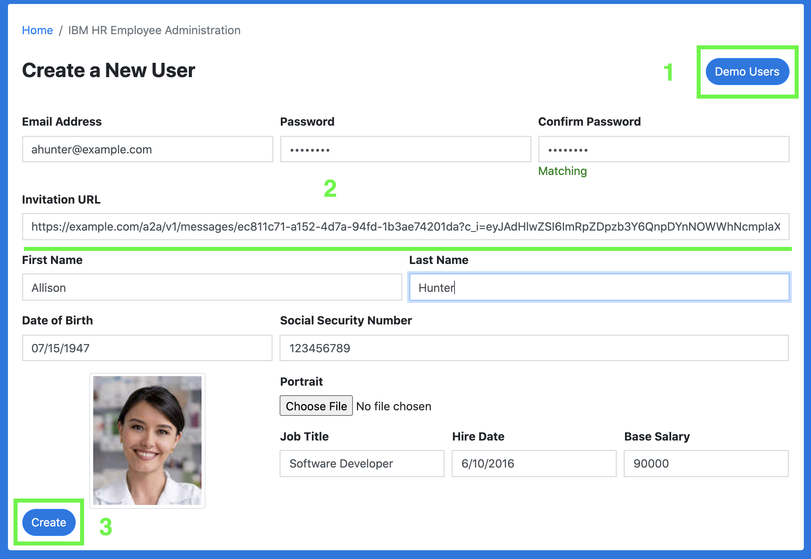
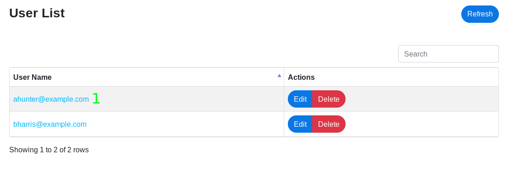
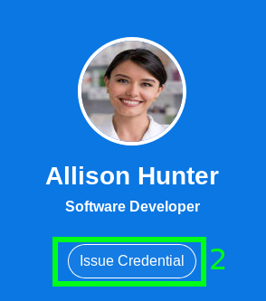
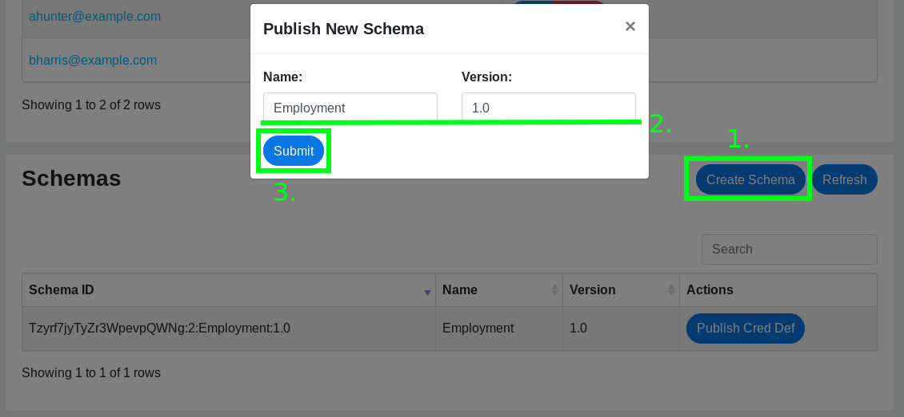
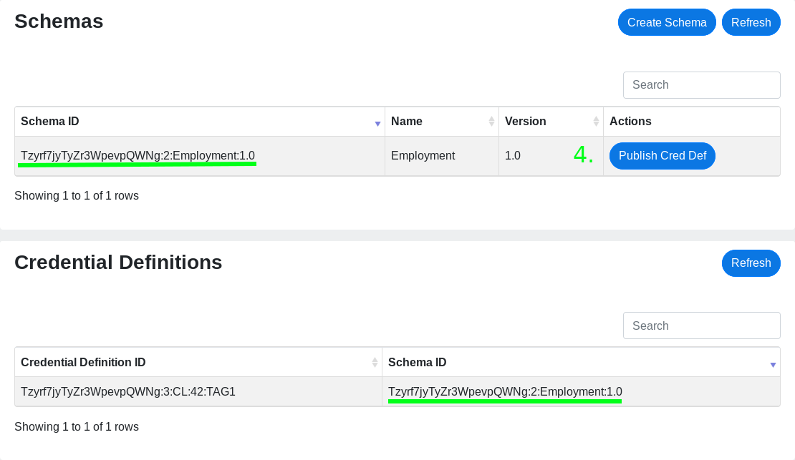

# IBM HR

This project contains the code necessary to run a mockup IBM HR portal that represents a credential issuing service hosted by IBM's human resources department.

The mock application is a Node.js [express](https://expressjs.com/) web app that serves up APIs and web pages related to signing up for a certificate of employment.

## Part 2: Issuing proof of employment

[Click here](../README.md#passwordless-authentication-demo) to start the demo over.

[Visit this page](https://ibm-hr.credimi-dev.us-south.containers.appdomain.cloud) to play with a running instance of this sample.

### Creating a HR user account

Now, you're going to pretend you work for IBM's Human Resources department, and you're creating an employee profile for
a new hir. You're going to fill out there information in IBM's employee database.

1. Click on the `Demo Users` button at the top of the page and select a user in from the list that appears.  You can
fill in the fields yourself, if you wish, but this is faster.
    > You should use the same name that you used when you created the DMV profile in Part 1.
2. Enter the Agent URL for the user.  This endpoint will be used to connect to the user's agent and issue their proof of
employment.
2. Review the information in the user creation from and click the `Create` button on the bottom of the form.
  

### Issuing the proof of employment

Now you're going to switch roles, pretending to be the employee.  You're going to sign in to IBM HR portal and deliver
your proof of employment credential to your agent.

1. Click on the user's User Name in the User List table to "sign in" as that user and open their employee profile page.
  
2. On the profile page, click the `Issue credential` button on the left panel of the page.
  
3. Accept the connection offer from `IBM HR` on your mobile app.
4. Accept the credential offer from `IBM HR` on your mobile app.

### Moving on...

You've complete the second step of the tutorial.  Next up is [signing up for a bank account...](../bbcu/README.md#signing-up-for-a-bank-account)

## Development

#### Publish a schema and a credential definition

> This only needs to be performed once. After the schema and credential definition are published, you can restart the
app without losing them.

1. From the admin page, click the `Create Schema` to open the schema creation modal.
2. (Optional) fill out the name and version of the schema.  The default values should be fine unless you're experimenting.
3. Click the `Submit` button.  The new schema should appear in the schema list momentarily.
  
4. Click the `Publish Cred Def` button on the entry in the Schemas table. The new credential definition should appear in
the Credential Definitions table momentarily.
  

Now you can create a demo user and issue a credential.