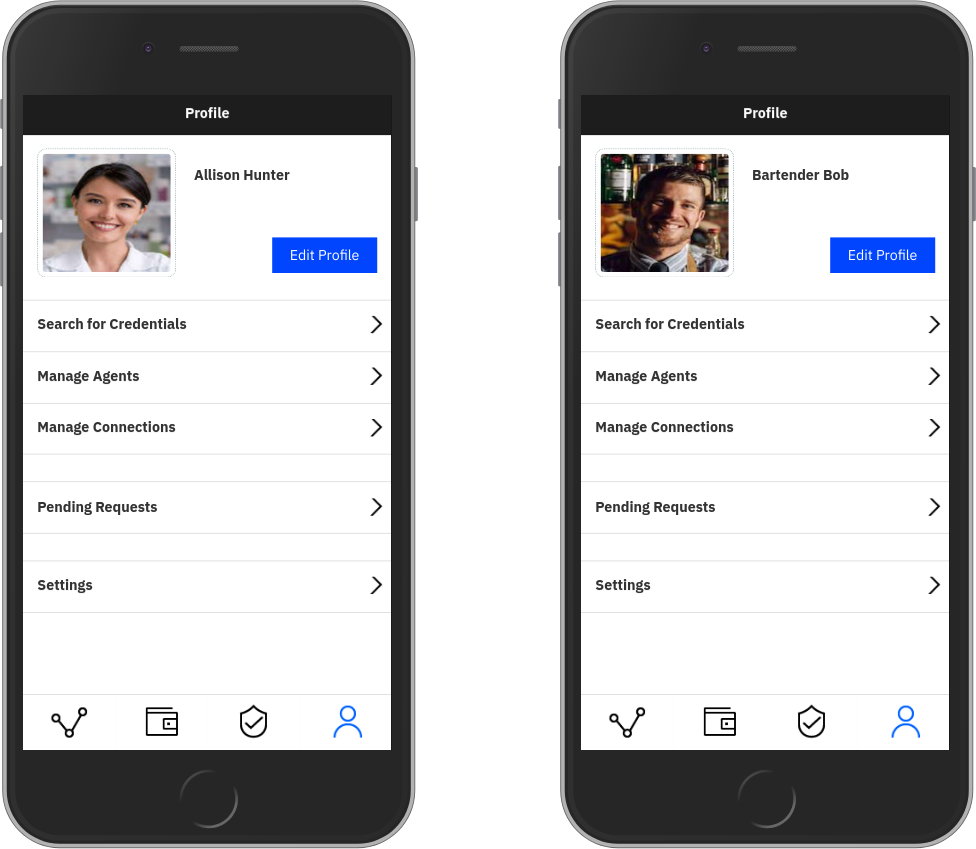
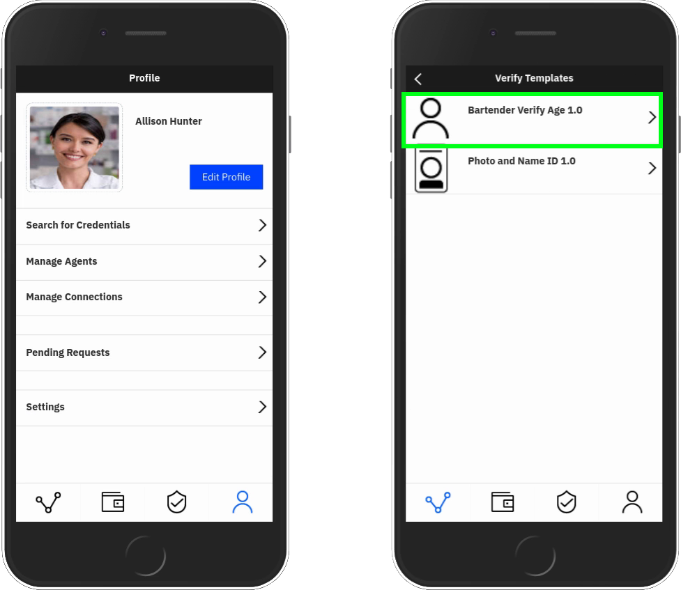
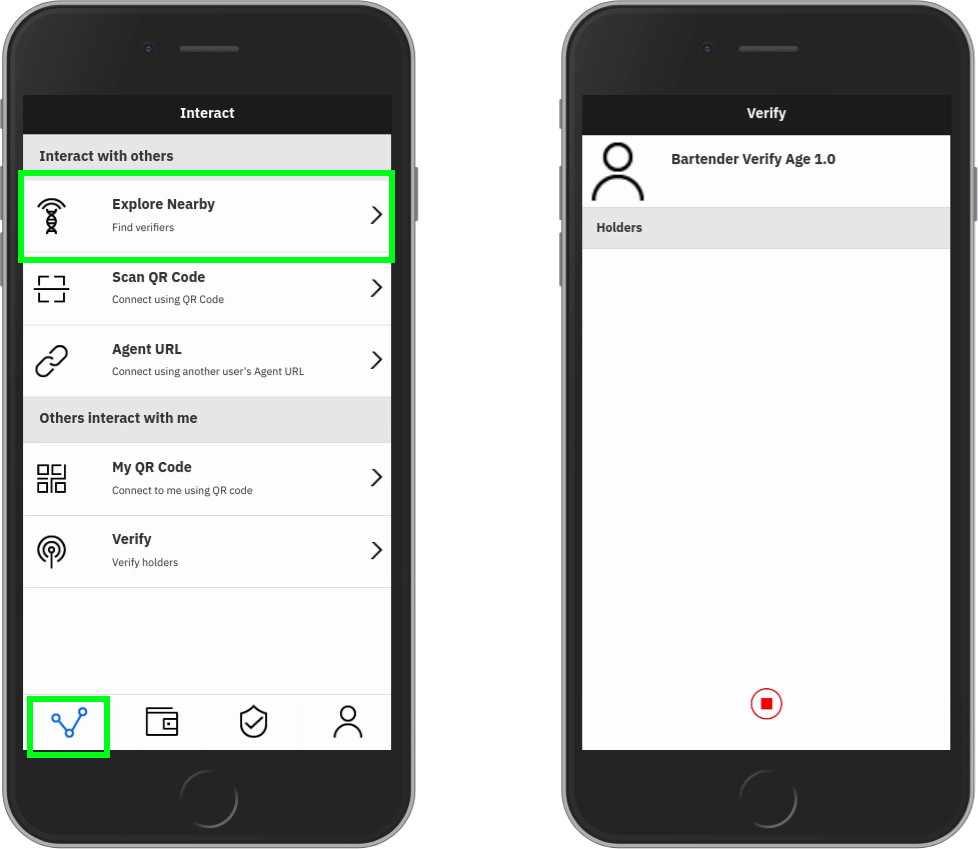
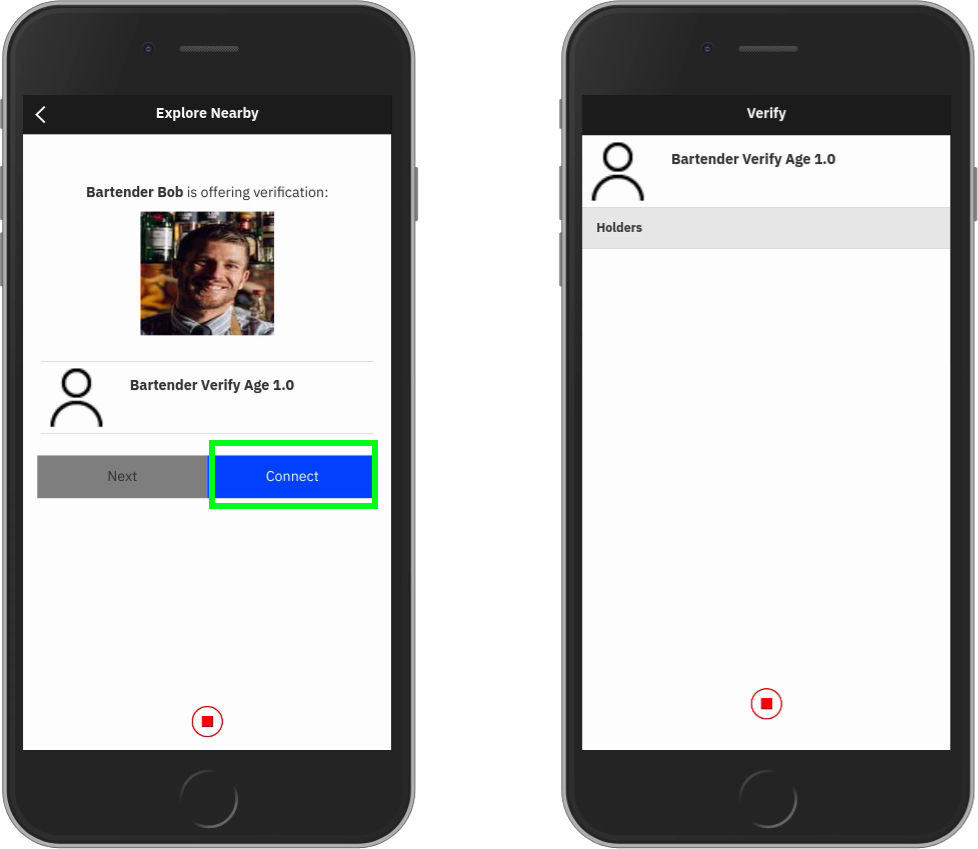
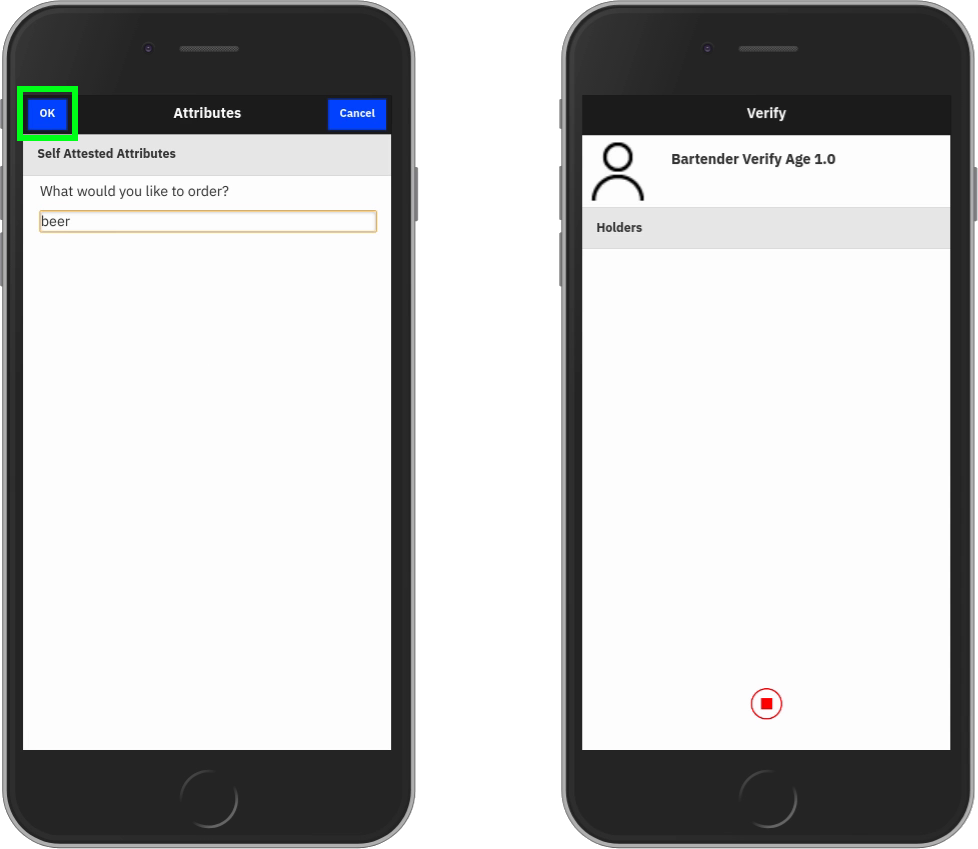
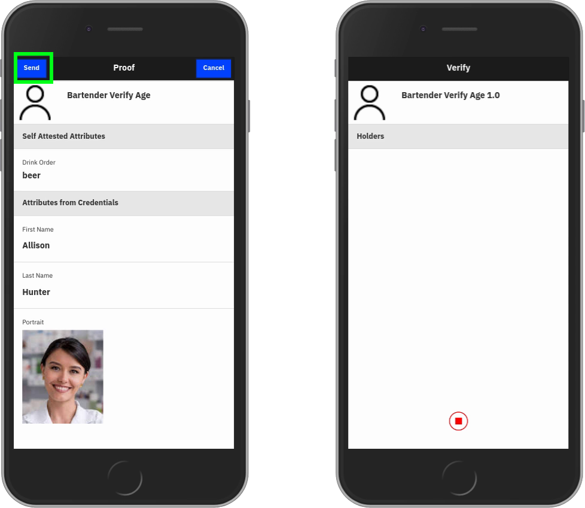
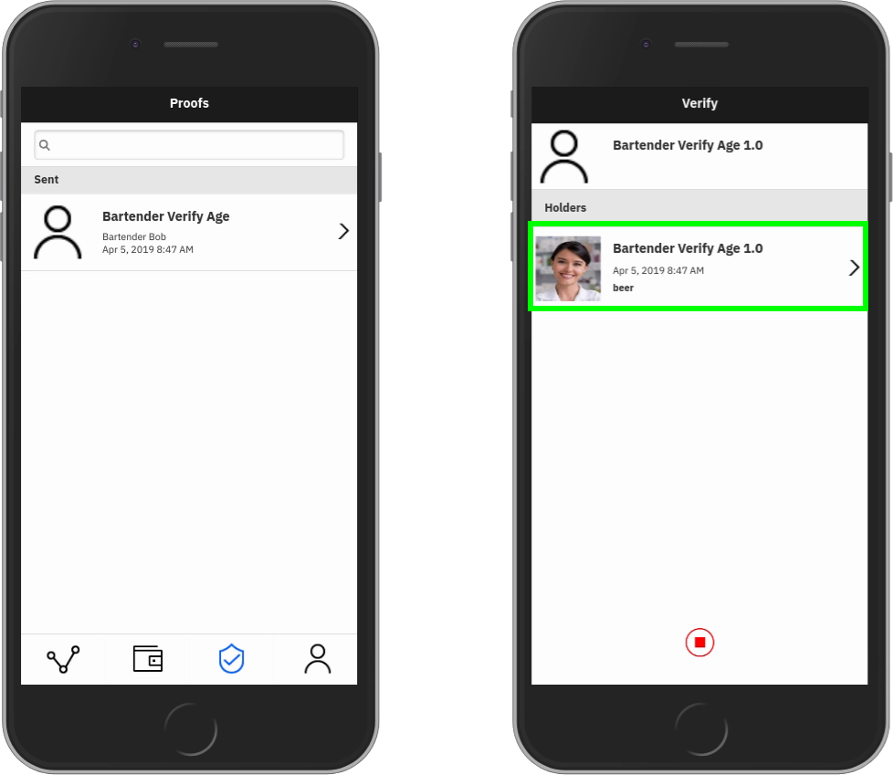

# Peer to Peer verification

Use the resources in this folder to develop your own demos and PoCs involving peer-to-peer verifications.

## Send a proof request to another agent from your device

### Requirements

In order to complete this tutorial, you will need:

1. Two devices with the mobile app installed.
2. Two agents 
3. Credential from [Part 1](../gov-dmv/README.md#part-1-issuing-a-drivers-license) and [Part 2](../ibm-hr/README.md#part-2-issuing-proof-of-employment)
of the [passwordless authentication demo](../README.md#passwordless-authentication) on one of the devices.  The device
with the credentials will act as the prover, while the fresh device will act as the verifier.



### Demo 1: Ordering a drink

You're bartending in a college town, and don't have time for underage students trying to score a drink with a fake ID.
A patron approaches the bar and orders a drink.  You ask them to provide verifiable proof of their age.

1. Open the verifications menu on the verifier device.
  
2. Select the `Bartender Verify Age` proof request.
  
3. On the prover device, open the connections menu and scan for nearby proof requests.
  
4. Select the age verification proof request when it appears.
  
5. Enter your drink order in the self attested attributes list.
  
5. Review the attributes that you're being asked to prove and submit the proof.
  
8. On the verifier device, select the proof response that appears on your screen.
  
9. Review the response and make sure the age predicate passed.  If it did, take a shot.  Repeat.
  > This demo will be a lot of fun at conferences.
  
### Demo 2: Providing multiple forms of ID

Sometimes, it might be nice to be able to prove your name, and have a record that you've done so, without letting someone
take and scan/photocopy/hold your ID.  We've provided a sample proof request that let's you do this.

1. Open the verifications menu on the verifier device.
2. Select the `Photo and Name ID` proof request.
3. On the prover device, open the connections menu and scan for nearby proof requests.
4. Select the photo and name proof request when it appears.
5. Review the attributes that you're being asked to prove and submit the proof.
7. On the verifier device, select the proof response that appears on your screen.
8. Review the response and make sure the photo matches the prover's face.  Use a mirror.  Putting the device's camera in
selfie mode can work in a pinch.

## Developing your own proofs

Try altering [bartender_verify_age.json](bartender_verify_age.json) and [photo_and_name_id](photo_and_name_id.json) to
suit your use case.  When you're ready to try the new proof schema on your devices, use this `curl` command to update
your verifier:
```
curl -u <verifier_agent_name>:<verifier_agent_password> -X POST -d '@<proof_schema_file>' https://<account_url>/api/v1/proof_schemas -H 'Content-Type: application/json'
```
The new proof schema should appear on your proof request list on your verifier device.